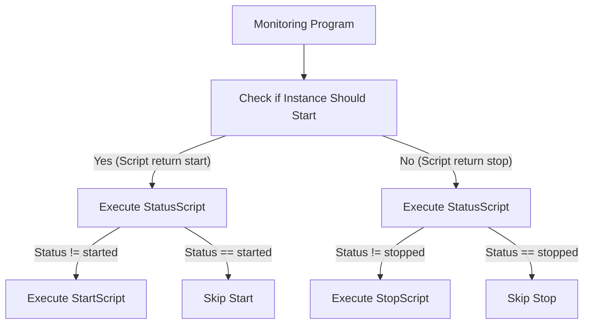

# Automatic Start/Stop of Disaster Recovery Instance

This mechanism enables automatic activation of the Secondary Harbor instance when a disaster occurs. It supports custom check mechanisms through user-defined scripts and provides control over Harbor dependency configurations.



## How to Configure and Run the Auto Start/Stop Program

1. Prepare the configuration file `config.yaml`:

    ```yaml
    condition_check_script: /path/to/condition_check.sh # Path to the condition check script. Executed periodically at check_interval intervals. Returns "start" to trigger start_script or "stop" to trigger stop_script.
    start_script: /path/to/start.sh # Path to the script that activates Harbor and its dependencies. Performs operations such as promoting PostgreSQL to primary, activating object storage, and scaling up Harbor components.
    stop_script: /path/to/stop.sh # Script path that deactivates Harbor and dependencies (e.g., scales down Harbor components, configures dependencies to standby mode).
    status_script: /path/to/status.sh # Script path that checks system state. Must output "started", "stopped", or "unknown".
    check_interval: 30s # Interval between condition check script executions
    failure_threshold: 6 # Number of consecutive failures required to trigger stop script. Prevents false positives from transient network issues.
    script_timeout: 120s # Maximum execution time for each script. Scripts exceeding this timeout will be terminated.
    ```

2. Create the corresponding script files:

    - **condition_check.sh**: Please customize this script according to your actual failover decision process. The script should output `start` if the cluster node should be activated, and output `stop` if it should be deactivated. If the script execution fails, no scripts will be called.

    Below is an example for reference—a simple DNS IP check (not recommended for production use):

      ```bash
      set -euo pipefail
      HARBOR_DOMAIN="${HARBOR_DOMAIN:-}"
      HARBOR_IP="${HARBOR_IP:-}"

      RESOLVED_IP=$(nslookup "$HARBOR_DOMAIN" 2>/dev/null | grep -A 1 "Name:" | grep "Address:" | awk '{print $2}' | head -n 1)
      if [ "$RESOLVED_IP" = "$HARBOR_IP" ]; then
        echo start
        exit 0
      else
        echo stop
        exit 0
      fi
      ```

    - **status.sh**: Script path that checks system state. Must output "started", "stopped", or "unknown". If script execution fails, it will be treated as unknown status and no changes will be made.

      ```bash
      set -euo pipefail
      
      # Status script for disaster recovery
      # This script will be executed before stop script to verify harbor is actually running
      
      # Read environment variables with validation
      HARBOR_NAMESPACE="${HARBOR_NAMESPACE:-harbor-ns}"
      HARBOR_NAME="${HARBOR_NAME:-harbor}"
      HARBOR_REPLICAS="${HARBOR_REPLICAS:-1}"
      
      # Check Harbor health status via health endpoint
      # Use HTTPS if available, fallback to HTTP for internal cluster communication
      HARBOR_SVC="${HARBOR_NAME}-core.${HARBOR_NAMESPACE}.svc"
      
      set +e
      # Check health endpoint with proper timeout and error handling
      HTTP_CODE=$(curl -sf --max-time 10 --connect-timeout 5 \
        -o /dev/null -w "%{http_code}" \
        "http://${HARBOR_SVC}/api/v2.0/health" 2>/dev/null)
      set -e
      
      # Get running pods count with proper error handling
      RUNNING_PODS=$(kubectl -n "$HARBOR_NAMESPACE" \
        get pods -l release="$HARBOR_NAME" \
        --field-selector=status.phase=Running \
        --no-headers \
        --request-timeout=5s 2>/dev/null | wc -l | tr -d ' ')
      
      # Validate pod count is numeric
      if [[ ! "$RUNNING_PODS" =~ ^[0-9]+$ ]]; then
        RUNNING_PODS="0"
      fi
      
      # Determine status based on HTTP code and running pods count
      # At least MIN_PODS_REQUIRED running pods are required (core, portal, jobservice, registry, trivy)
      # When service has no endpoints (pods not running), curl will fail and HTTP_CODE will be empty or "000"
      if [ "$HTTP_CODE" = "200" ] && [ -n "$RUNNING_PODS" ] && [ "$RUNNING_PODS" -ge 5 ]; then
        # Harbor is healthy: HTTP 200 and sufficient pods running
        echo "started"
      elif ([ -z "$HTTP_CODE" ] || [ "$HTTP_CODE" = "000" ] || [ "$HTTP_CODE" = "" ]) && \
           ([ -z "$RUNNING_PODS" ] || [ "$RUNNING_PODS" -eq 0 ]) then
        echo "stopped"
      else
        # Other network errors, unexpected HTTP codes, or inconsistent states
        # This includes cases like:
        # - HTTP 5xx errors (service degraded but pods running)
        # - HTTP 4xx errors (authentication/authorization issues)
        # - Partial pod failures (some pods running but not all)
        # - Network timeouts or connection refused
        echo "unknown"
      fi
      ```

    - **start.sh**: The start script should include checks for Harbor dependencies and the startup of the Harbor instance.

      ```bash
      set -euo pipefail
      # Check and control dependencies, such as verifying if the database is the primary instance
      # and if the object storage is ready
      #####################################
      # Add your PostgreSQL start script here.
      # This script should promote the secondary PostgreSQL to primary role and ensure
      # the database is ready to serve Harbor before starting Harbor components.
      #####################################

      #####################################
      # Add your S3/Object Storage start script here.
      # This script should promote the secondary object storage to primary role and ensure
      # the storage system is ready to serve Harbor before starting Harbor components.
      #####################################

      # Start Harbor script - this section is required
      HARBOR_NAMESPACE="${HARBOR_NAMESPACE:-harbor-ns}"
      HARBOR_NAME="${HARBOR_NAME:-harbor}"
      HARBOR_REPLICAS="${HARBOR_REPLICAS:-1}"
      kubectl -n "$HARBOR_NAMESPACE" patch harbor "$HARBOR_NAME" --type=merge -p "{\"spec\":{\"helmValues\":{\"core\":{\"replicas\":$HARBOR_REPLICAS},\"portal\":{\"replicas\":$HARBOR_REPLICAS},\"jobservice\":{\"replicas\":$HARBOR_REPLICAS},\"registry\":{\"replicas\":$HARBOR_REPLICAS},\"trivy\":{\"replicas\":$HARBOR_REPLICAS}}}}"
      ```

    - **stop.sh**: The stop script should include shutdown procedures for Harbor dependencies and the Harbor instance.

      ```bash
      set -euo pipefail
      # Stop Harbor script - this section is required
      HARBOR_NAMESPACE="${HARBOR_NAMESPACE:-harbor-ns}"
      HARBOR_NAME="${HARBOR_NAME:-harbor}"
      kubectl -n "$HARBOR_NAMESPACE" patch harbor "$HARBOR_NAME" --type=merge -p '{"spec":{"helmValues":{"core":{"replicas":0},"portal":{"replicas":0},"jobservice":{"replicas":0},"registry":{"replicas":0},"trivy":{"replicas":0}}}}'
      
      # Check and control dependencies, such as setting the database to replica mode
      #####################################
      # Add your PostgreSQL stop script here.
      # This script should configure the PostgreSQL cluster to operate as a replica
      # and scale down instances when stopping Harbor components.
      #####################################

      #####################################
      # Add your S3/Object Storage stop script here.
      # This script should handle any necessary cleanup or configuration changes
      # for the object storage when stopping Harbor components.
      #####################################
      ```

3. Deploy the control program as a Deployment in the Harbor namespace:

    ```yaml
    apiVersion: v1
    automountServiceAccountToken: true
    kind: ServiceAccount
    metadata:
      name: disaster-recovery
      namespace: system # replace with your own namespace
    ---
    apiVersion: rbac.authorization.k8s.io/v1
    kind: ClusterRole
    metadata:
      name: disaster-recovery-clusterrole
    rules: []  # Add necessary permissions
    ---
    apiVersion: rbac.authorization.k8s.io/v1
    kind: ClusterRoleBinding
    metadata:
      name: disaster-recovery-clusterrolebinding
    roleRef:
      apiGroup: rbac.authorization.k8s.io
      kind: ClusterRole
      name: disaster-recovery-clusterrole
    subjects:
    - kind: ServiceAccount
      name: disaster-recovery
      namespace: system # replace with your own namespace
    ---
    apiVersion: v1
    data:
      check.sh: |
        # replace with your own script
      config.yaml: |
        condition_check_script: /scripts/check.sh
        start_script: /scripts/start.sh
        stop_script: /scripts/stop.sh
        status_script: /scripts/status.sh
        check_interval: 10s
        failure_threshold: 3
        script_timeout: 120s
      start.sh: |
        # replace with your own script
      status.sh: |
        # replace with your own script
      stop.sh: |
        # replace with your own script
    kind: ConfigMap
    metadata:
      name: disaster-recovery-config
      namespace: system # replace with your own namespace
    ---
    apiVersion: apps/v1
    kind: Deployment
    metadata:
      labels:
        app: disaster-recovery
      name: disaster-recovery
      namespace: system # replace with your own namespace
    spec:
      replicas: 1
      selector:
        matchLabels:
          app: disaster-recovery
      template:
        metadata:
          labels:
            app: disaster-recovery
        spec:
          containers:
          - command:
            - sh
            - -c
            - |
              exec /opt/bin/disaster-recovery -config /opt/config/config.yaml
            image: build-harbor.alauda.cn/test/harbor-disaster-recovery:2.12.4-dev-7b8c78a-kychen
            name: controller
            resources:
              limits:
                cpu: 500m
                memory: 512Mi
              requests:
                cpu: 100m
                memory: 128Mi
            volumeMounts:
            - mountPath: /opt/bin/
              name: bin
              readOnly: true
            - mountPath: /opt/config
              name: config
              readOnly: true
            - mountPath: /opt/script
              name: scripts
              readOnly: true
          initContainers:
          - command:
            - sh
            - -c
            - |
              cp /disaster-recovery /opt/bin/disaster-recovery && chmod +x /opt/bin/disaster-recovery
            image: build-harbor.alauda.cn/test/harbor-disaster-recovery:2.12.4-dev-7b8c78a-kychen
            imagePullPolicy: Always
            name: copy-binary
            volumeMounts:
            - mountPath: /opt/bin/
              name: bin
          serviceAccountName: disaster-recovery
          volumes:
          - emptyDir: {}
            name: bin
          - configMap:
              name: disaster-recovery-config
            name: scripts
          - configMap:
              items:
              - key: config.yaml
                path: config.yaml
              name: disaster-recovery-config
            name: config
    ```

> **Note**: Ensure that the ServiceAccount used by the Deployment has the necessary RBAC permissions to operate on Harbor resources and any other resources controlled by your custom scripts (such as database resources, object storage configurations, etc.) in the target namespace. The control program needs permissions to modify Harbor CRD resources to start and stop Harbor components, as well as permissions for any resources managed by the custom start/stop scripts. The following are the permissions required for Harbor operations:

  ```yaml
  apiVersion: rbac.authorization.k8s.io/v1
  kind: ClusterRole
  metadata:
    name: disaster-recovery-clusterrole
  rules:
  - apiGroups:
    - operator.alaudadevops.io
    resources:
    - harbors
    verbs:
    - get
    - list
    - watch
    - update
    - patch
  - apiGroups:
    - ""
    resources:
    - pods
    verbs:
    - get
    - list
    - watch
  - apiGroups:
    - ""
    resources:
    - pods/exec
    verbs:
    - create
  ```


## `Alauda support for PostgreSQL` Start/Stop Script Examples

When using the `Alauda support for PostgreSQL` solution with the `PostgreSQL Hot Standby Cluster Configuration Guide` to configure a disaster recovery cluster, you need to configure replication information in both Primary and Secondary PostgreSQL clusters. This ensures that during automatic failover, you only need to modify `clusterReplication.isReplica` and `numberOfInstances` to complete the switchover:

**Primary Configuration:**

```yaml
clusterReplication:
  enabled: true
  isReplica: false
  peerHost: 192.168.130.206  # Secondary cluster node IP
  peerPort: 31661            # Secondary cluster NodePort
  replSvcType: NodePort
  bootstrapSecret: standby-bootstrap-secret
```

The `standby-bootstrap-secret` should be configured according to the `Standby Cluster Configuration` section in the `PostgreSQL Hot Standby Cluster Configuration Guide`, using the same value as the Secondary cluster.

**Secondary Configuration:**

```yaml
clusterReplication:
  enabled: true
  isReplica: true
  peerHost: 192.168.12.108  # Primary cluster node IP
  peerPort: 30078            # Primary cluster NodePort
  replSvcType: NodePort
  bootstrapSecret: standby-bootstrap-secret
```

**Note**: The following RBAC permissions are required:

```yaml
apiVersion: rbac.authorization.k8s.io/v1
kind: ClusterRole
metadata:
  name: disaster-recovery-clusterrole
rules:
- apiGroups:
  - acid.zalan.do
  resources:
  - postgresqls
  verbs:
  - get
  - list
  - watch
  - update
  - patch
- apiGroups:
  - ""
  resources:
  - pods
  verbs:
  - get
  - list
  - watch
- apiGroups:
  - ""
  resources:
  - pods/exec
  verbs:
  - create
```

### Start Script Example

```bash
POSTGRES_NAMESPACE="${POSTGRES_NAMESPACE:-pg-namespace}"
POSTGRES_CLUSTER="${POSTGRES_CLUSTER:-acid-pg}"
kubectl -n "$POSTGRES_NAMESPACE" patch pg "$POSTGRES_CLUSTER" --type=merge -p '{"spec":{"clusterReplication":{"isReplica":false},"numberOfInstances":2}}'
```

### Stop Script Example

```bash
POSTGRES_NAMESPACE="${POSTGRES_NAMESPACE:-pg-namespace}"
POSTGRES_CLUSTER="${POSTGRES_CLUSTER:-acid-pg}"
kubectl -n "$POSTGRES_NAMESPACE" patch pg "$POSTGRES_CLUSTER" --type=merge -p '{"spec":{"clusterReplication":{"isReplica":true},"numberOfInstances":1}}'
```

## Alauda Build of Rook-Ceph Start/Stop Script Examples

**Note**: The following RBAC permissions are required:

```yaml
apiVersion: rbac.authorization.k8s.io/v1
kind: ClusterRole
metadata:
  name: disaster-recovery-clusterrole
rules:
- apiGroups:
  - ""
  resources:
  - secrets
  verbs:
  - get
  - list
  - watch
- apiGroups:
  - ""
  resources:
  - configmaps
  verbs:
  - get
  - list
  - watch
- apiGroups:
  - ceph.rook.io
  resources:
  - cephobjectzones
  verbs:
  - get
  - list
  - watch
- apiGroups:
  - ""
  resources:
  - pods
  verbs:
  - get
  - list
  - watch
- apiGroups:
  - ""
  resources:
  - pods/exec
  verbs:
  - create
```

- **Start Script Example**: For more details, refer to [Object Storage Disaster Recovery](https://docs.alauda.io/container_platform/4.1/storage/storagesystem_ceph/how_to/disaster_recovery/dr_object.html)

  ```bash
  REALM_NAME="${REALM_NAME:-real}"
  ZONE_GROUP_NAME="${ZONE_GROUP_NAME:-group}"
  ZONE_NAME="${ZONE_NAME:-zone}"

  ACCESS_KEY=$(kubectl -n rook-ceph get secrets "${REALM_NAME}-keys" -o jsonpath='{.data.access-key}' 2>/dev/null | base64 -d)
  SECRET_KEY=$(kubectl -n rook-ceph get secrets "${REALM_NAME}-keys" -o jsonpath='{.data.secret-key}' 2>/dev/null | base64 -d)
  ENDPOINT=$(kubectl -n rook-ceph get cephobjectzone realm-zone -o jsonpath='{.spec.customEndpoints[0]}')
  TOOLS_POD=$(kubectl -n rook-ceph get po -l app=rook-ceph-tools -o jsonpath='{.items[0].metadata.name}' 2>/dev/null)

  kubectl -n rook-ceph exec "$TOOLS_POD" -- radosgw-admin realm pull --url="$ENDPOINT" --access-key="$ACCESS_KEY" --secret="$SECRET_KEY";
  kubectl -n rook-ceph exec "$TOOLS_POD" -- radosgw-admin zone modify --rgw-realm="$REALM_NAME" --rgw-zonegroup="$ZONE_GROUP_NAME" --rgw-zone="$ZONE_NAME" --master
  ```

- **Stop Script**: No action is required when stopping Alauda Build of Rook-Ceph, so you can add an empty script or skip this step.
